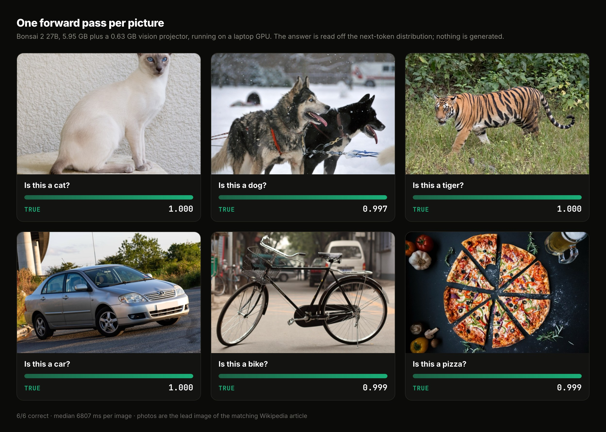

# Pictures

Same primitive, on images. Bonsai 2 27B is a vision-language model, so the
photo goes in the prompt, the options are lettered, and the answer is read off
the next-token distribution in one forward pass. Nothing is generated and
nothing is parsed.



```console
$ python3 vision_score.py -q "Is this a bike?" --image images/bicycle.jpg
{"choice": "true", "probabilities": {"true": 0.999, "false": 0.001},
 "label_mass": 0.996, "forward_s": 6.813, "tokens": 1102}
```

## Jev cannot do this

Worth saying plainly, because it is the one thing the local model does that the
hosted reference does not. From [TypeSafe's own docs](https://docs.typesafe.ai/concepts/state.md):

> Jev accepts text only. State must be a string, JSON object, or array of text
> values. Images, audio, and video are not supported (yet).

So there is no Jev column below. On every text task in this repo Jev is ahead;
here it does not compete.

## Results

Apple M4 Pro, Bonsai 2 27B `PTQ1_0` plus its 0.63 GB vision projector, images
capped at 768px. Six photos, each the lead image of the matching Wikipedia
article, each asked about itself.

| Image | Question | Answer | p(true) | `label_mass` |
|---|---|---|---|---|
| cat | Is this a cat? | true | 1.000 | 0.995 |
| dog | Is this a dog? | true | 0.997 | 0.994 |
| tiger | Is this a tiger? | true | 1.000 | 0.996 |
| car | Is this a car? | true | 1.000 | 0.997 |
| bicycle | Is this a bike? | true | 0.999 | 0.996 |
| pizza | Is this a pizza? | true | 0.999 | 0.995 |

A six-way **"what is the main subject?"** over the same photos is also 6/6,
every answer at p ≥ 0.998, including separating the tiger from the cat at
1.000.

**12/12 overall, median 6.8 s per image.**

### Only the 27B models can see

Worth knowing before you plan around this: within Bonsai, **vision is a 27B-only
feature**. Checking every published GGUF repo for a projector:

| Model | `mmproj` |
|---|---|
| Bonsai 1.7B / 4B / 8B, and their Ternary versions | none |
| Bonsai 1 27B, Ternary Bonsai 1 27B, Bonsai 2 27B | yes |

There is no small Bonsai VLM. The `bonsai-image-binary-4B` and
`bonsai-image-ternary-4B` releases are **not** vision-language models despite
the name: they are `text-to-image` diffusion transformers (FLUX.2 Klein), so
they generate pictures rather than answer questions about them.

### Two levers on speed, both measured

**Resolution.** Latency is roughly linear in image tokens, and on an easy
question accuracy does not move:

| Long edge | Image tokens | Latency (Bonsai 2 27B) | p(true) |
|---|---|---|---|
| 256px | 135 | **2.0 s** | 0.999 |
| 384px | 215 | 3.2 s | 0.999 |
| 512px | 327 | 4.4 s | 0.999 |
| 768px | 647 | 8.6 s | 1.000 |

**The older 27B.** Bonsai 1 27B is smaller and quicker, and on this set loses
nothing:

| Model | On disk | 256px | 768px | Correct |
|---|---|---|---|---|
| **Bonsai 1 27B** | 3.80 GB | **1.3 s/frame** | 4.5 s | 6/6 at both |
| Bonsai 2 27B | 5.95 GB | 2.0 s/frame | 6.1 s | 6/6 at both |

So the fastest honest number here is **~1.3 s per frame**, from Bonsai 1 27B at
256px. Do not read "6/6 both" as "the two models are equivalent": these six
photos are easy and both saturate. Bonsai 2 is clearly ahead on text
([WANLI](../../README.md#results) 74.6% against 71.1%), and a harder vision set
would likely separate them too.

### Asking several questions about one frame does not amortise

Five different questions about the same photo each cost full price, about
8.5 s at 768px. The image is a shared prefix, so in principle the prefill
could be reused across the five, but it is not being reused here. If that is
fixable, N questions per frame becomes one prefill plus N cheap decisions,
which is a much better shape than N full passes.

### Cost

Images are expensive in context. A 1.6 MB photo came to **4081 prompt tokens on
its own**, which overflowed a 4096 context before the question was added. The
fixtures here are capped at 768px and the server runs at 8192.

## Running it

```bash
# weights, then the vision projector, which is a separate 0.63 GB file
python3 ../../scripts/download_model.py Ternary-Bonsai-2-27B
curl -L -o ../../bonzi/models/Ternary-Bonsai-2-27B/Ternary-Bonsai-2-27B-mmproj-Q8_0.gguf \
  https://huggingface.co/prism-ml/Ternary-Bonsai-2-27B-gguf/resolve/main/Ternary-Bonsai-2-27B-mmproj-Q8_0.gguf

PYTHONPATH=../../openjev python3 vision_score.py --json ../../results/vision.json
python3 make_grid.py          # redraws vision-grid.jpg from those results

# the fast configuration: older 27B, small images
PYTHONPATH=../../openjev python3 vision_score.py --model Bonsai-27B --px 256
```

`make_grid.py` reads the results file rather than hard-coded numbers, so the
grid cannot drift away from the measurements.

## How it differs from the text scorer

The text path uses `/completion` with `n_probs`. Images need an `image_url`,
which that endpoint does not take, so this uses `/v1/chat/completions` with
`logprobs` and `top_logprobs` instead and reads the option letters out of the
returned distribution. Same idea, different door.

Check the server really loaded the projector:

```console
$ curl -s localhost:PORT/props | jq .modalities
{ "vision": true, "video": true, "audio": false }
```
